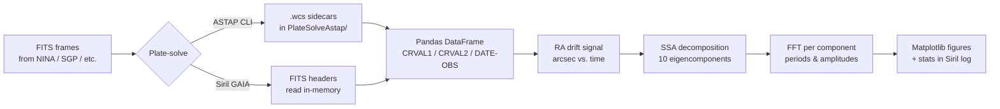
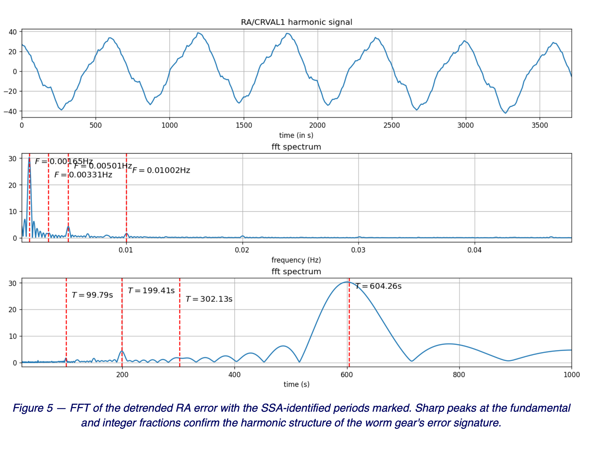
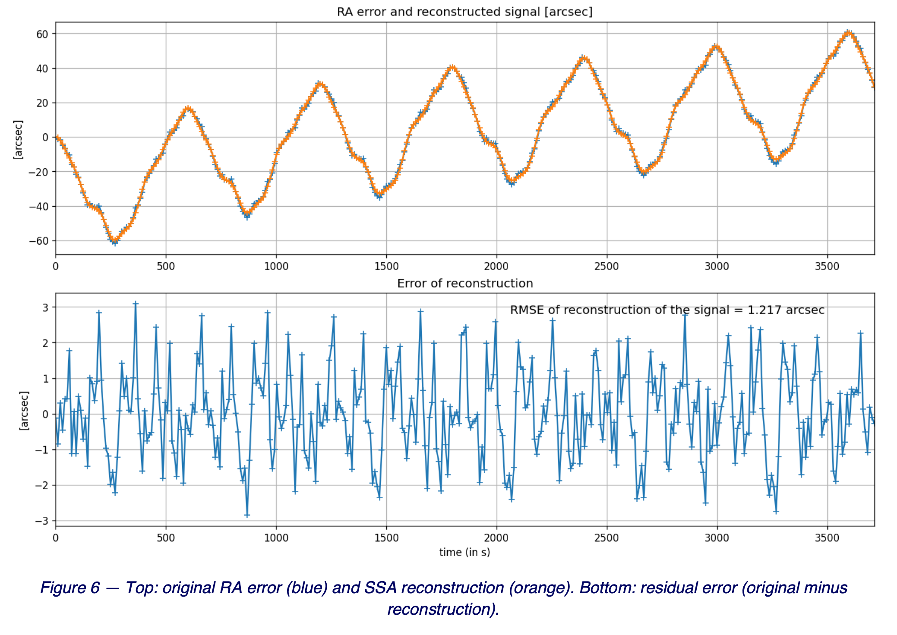

# Periodic Error Analysis

A [Siril](https://siril.org/) Python script that estimates the **periodic error (PE)** of an equatorial telescope mount from a time series of FITS frames.

The pipeline plate-solves each frame with either [ASTAP](https://www.hnsky.org/astap.htm) (via the external CLI) or Siril's built-in GAIA-backed solver, extracts the RA / DEC drift in arcseconds vs. time, then decomposes the RA error with **Singular Spectrum Analysis** and identifies the dominant periodic components (fundamental + harmonics) via an FFT. Output is a set of matplotlib figures (raw RA/DEC, drift fit, singular spectrum, reconstructed signal, per-component statistics, full FFT) and a per-component log in Siril's log panel.

The Singular Spectrum Analysis (SSA) function is based on Matlab code from Francisco Javier Alonso Sanchez, Departament of Electronics and Electromecanical Engineering Industrial Engineering School, University of Extremadura, Badajoz, Spain and improved by François Auger, Nantes University, France, *"The Sliding Singular Spectrum Analysis: A Data-Driven Nonstationary Signal Decomposition Tool"*, IEEE TRANSACTIONS ON SIGNAL PROCESSING vol. 66 no. 1, January 2018.

## Example output

Two of the synthesis figures the script produces (also embedded in the optional PDF report) — the dominant periodicities identified by the SSA + FFT pipeline, and how well a sum of those components reconstructs the original RA error signal:

| FFT with SSA-identified periods | Signal reconstruction |
|---|---|
|  |  |

*Left:* the RA error's full FFT, with red dashed lines at the fundamental and each harmonic period recovered by SSA — the visual fingerprint of the worm gear's error signature. *Right:* the original signal overlaid with the SSA reconstruction (top), and the residual after subtraction (bottom) annotated with its RMS — what's left after periodic components have been removed is the unmodeled components, noise and error due to the SSA algorithm.

## Requirements

- **Siril ≥ 1.3.6** (provides the Python interpreter and the `sirilpy` module).
- **A plate-solver**: either ASTAP installed locally, or Siril's built-in GAIA solver (no extra install — the catalog is fetched on first use).
- All Python dependencies (`numpy`, `pandas`, `matplotlib`, `astropy`, `unidecode`, `ttkthemes`, `reportlab`) are auto-installed on first launch into Siril's bundled venv via `sirilpy.ensure_installed`. `reportlab` is only used when the optional PDF report is enabled.

## Usage

1. In Siril, **set the working directory** to the folder containing your capture FITS frames (folder icon in the main window, or `cd /path/to/fits` in the command bar).
2. Place the script in a directory and add this folder in *Preferences >  Scripts > Scripts Storage Directories*.
3. Launch the script from **Siril → Scripts** (or via Siril's Python script runner). It cannot be run with `python PE_Analysis.py` directly — it talks to a running Siril instance over IPC.
4. In the GUI:
   - Pick a plate-solver: **ASTAP** (browse to the executable if the default path doesn't match) or **SIRIL (GAIA)** (no path needed — Siril's built-in solver runs in-process). The selected paths are persisted to `config_PE.txt` next to the script.
   - Set the **begin / end frame indices** to constrain the analysis window. The window must contain at least **58 frames** — the Singular Spectrum Analysis stage extracts 10 eigencomponents, which requires the trajectory-matrix dimension `L = n / 5.71` to be ≥ 10. Narrower windows are rejected with a clear error.
   - Toggle **Run plate solve** off to reuse the WCS results from a previous **ASTAP** run (cached in a `PlateSolveAstap/` subfolder of your FITS directory). The Siril/GAIA path does not cache — it always re-solves, so this toggle must stay enabled when SIRIL is selected.
   - (Optional) In the **Report** section, edit the title (auto-populated from the FITS `OBJECT` keyword or the folder name) and tick **Save PDF report** to write a multi-page PDF with cover, methodology and results next to the FITS folder.
   - Click **Process**.

Progress and per-component statistics (RA / DEC drift, mean sampling period of the image capture, eigencomponent grouping, fundamental period and amplitude, harmonics min/max/RMS, reconstruction RMSE) stream to Siril's log panel. Plots open in separate matplotlib windows. When the **Save PDF report** option is enabled, a self-contained `<folder>_PE_report_<timestamp>.pdf` is also written next to the FITS folder.

## Limitations

- **Siril/GAIA path always re-solves** — cached reuse via the "Run plate solve" toggle is ASTAP-only for now (the Siril loop keeps WCS in memory and doesn't write sidecars). Focal-length and pixel-size hints (`FOCALLEN`, `XPIXSZ × XBINNING`) are passed to Siril's solver from the first frame's FITS header so the per-frame solve doesn't waste time on blind scale search.
- **Long captures freeze the GUI** during plate-solving (processing is synchronous, on the Tk main thread). Log messages still flow.

## License

Distributed under [Creative Commons Attribution-NonCommercial-ShareAlike 4.0 International (CC BY-NC-SA 4.0)](https://creativecommons.org/licenses/by-nc-sa/4.0/).

## Authors

- Mickaël HILAIRET — LS2N / École Centrale de Nantes, France
- Gilles MORAIN — France
